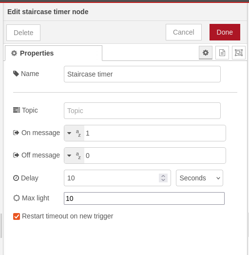

# Node-red-staircase-timer
[](https://sonarcloud.io/summary/new_code?id=tbowmo_node-red-staircase-timer)


A Node-RED staircase type timer, turns on output for a specified time when triggered by an input with payload specified. can be disabled by light level (use a lux sensor for input f.ex.) and also overall disable until it's enabled again

# Install
Either use the palette manager in Node-RED to install the plugin, or use a terminal to install directly in your local installation of Node-RED:
```bash
npm install @tbowmo/node-red-staircase-timer
```

Once installed, restart your node-red server, and you will have a set of new nodes available in your palette under timers.

# Setup
<br>
Set the minimum light level, if used (remember to add a flow that can send a message with the `light_level` property), and configure the on/off messages to match your desired behavior.

If `Restart timeout on new trigger` is checked (default), the timer will restart each time the input is triggered by a truthy payload. Note that if the output has already emitted an `onMsg`, a new `onMsg` will not be emitted in this case.

If unchecked, successive triggers will not restart the timeout.

# Output

The node has a single output, which provides a standard node-red object:
```ts
{
    payload: object, string, number // as setup in the node
    topic: string // (as setup in the node)
}

```

# Input

If payload is present (not undefined) the output will be triggered, unless the node is either disabled or the light level is above the set threshold

## Optional properties on input message
| property | type    | description
|----------|---------|--------------------------------
| disable  | boolean | If set to true, then the node is disabled. If the timer is actively running, then the current timeout is handled as usual.
| ligt_sensor | number  | This is used to inform the node of the current light level. If the light level is above the set threshold, then the timer will be disabled
